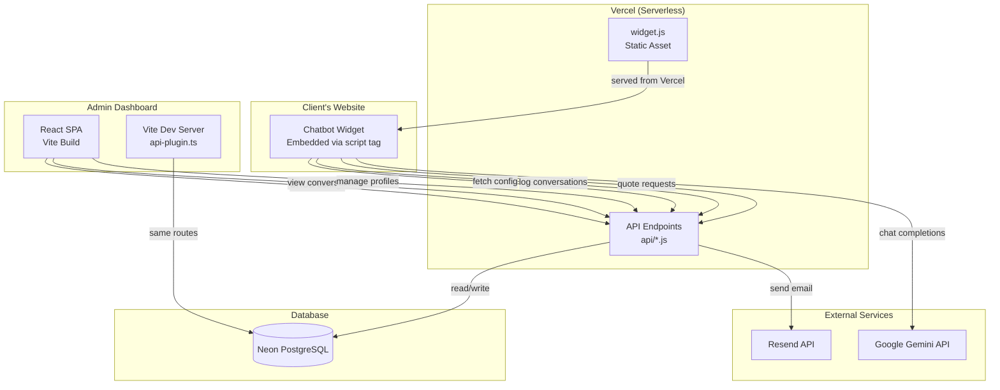
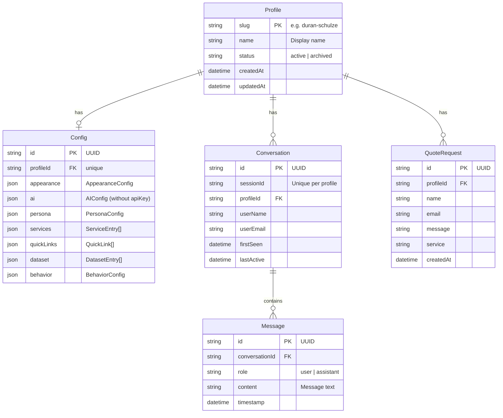
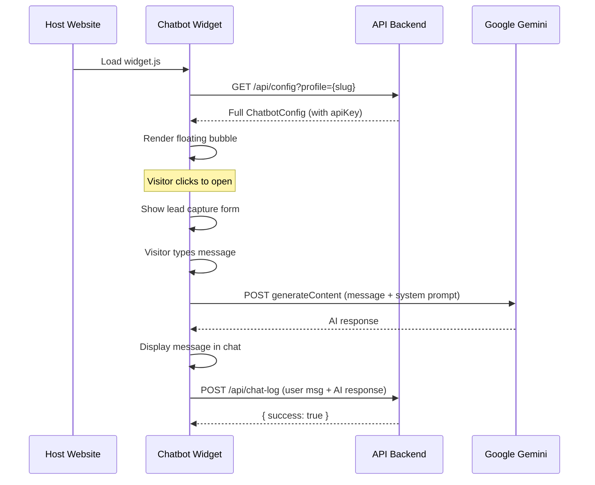
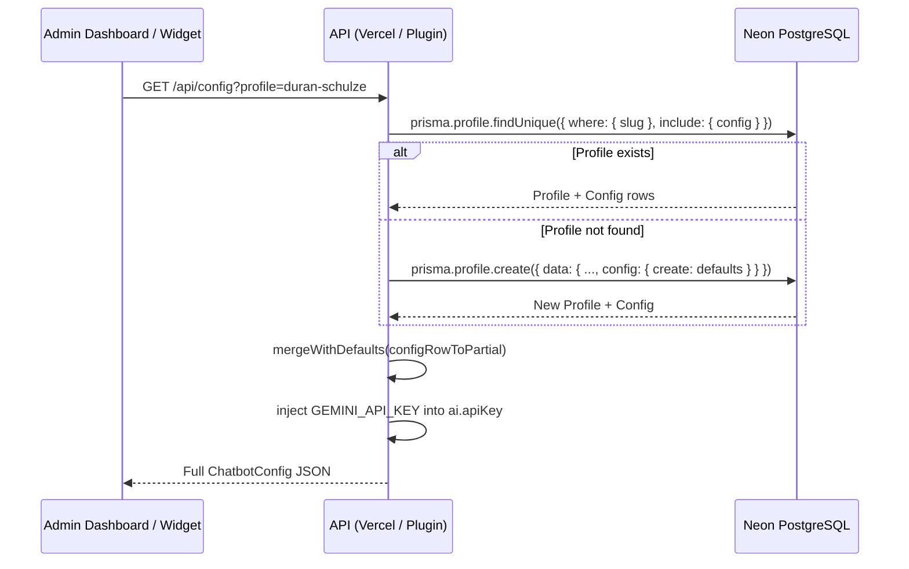
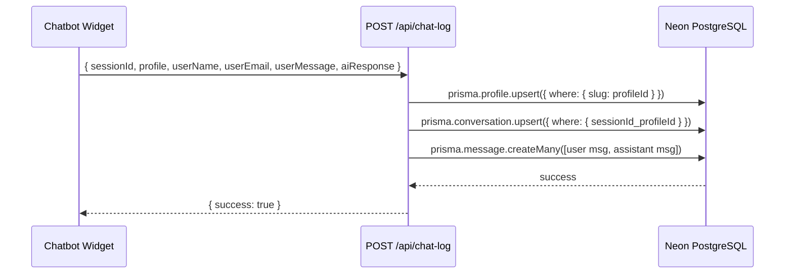
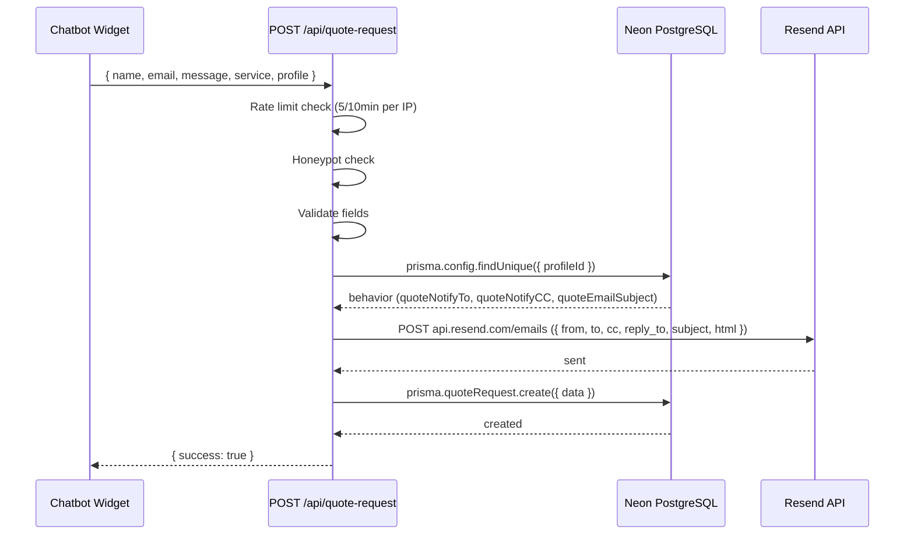

# Duran Chatbot — System Documentation

> **Last updated:** 2026-06-02  
> **Project:** Duran Chatbot — AI-powered legal assistant chatbot with multi-profile management, conversation logging, and quote request handling.

---

## Table of Contents

1. [Project Overview](#1-project-overview)
2. [Architecture](#2-architecture)
3. [Package Structure](#3-package-structure)
4. [Database Schema](#4-database-schema)
5. [API Endpoints](#5-api-endpoints)
6. [Admin Application](#6-admin-application)
7. [Widget](#7-widget)
8. [Configuration System](#8-configuration-system)
9. [Authentication & Security](#9-authentication--security)
10. [Data Flow](#10-data-flow)
11. [Deployment](#11-deployment)
12. [Environment Variables](#12-environment-variables)

---

## 1. Project Overview

### What is it?

Duran Chatbot is an **AI-powered chatbot platform** designed for law firms and professional services. It provides an embeddable chat widget that website visitors can use to ask questions about legal services. The system includes:

- A **client-side widget** that law firms embed on their websites
- An **admin dashboard** where lawyers manage chatbot behavior, appearance, knowledge base, and review conversations
- A **backend API** (deployed on Vercel serverless functions) that powers the admin dashboard and widget config delivery
- A **PostgreSQL database** (Neon) for persistent storage of profiles, configs, conversations, and quote requests

### Who is it for?

The primary deployment is for **Duran & Duran-Schulze Law**, a Philippine law firm. The system supports **multiple profiles** so different law firms or departments can each have their own branded chatbot instance.

### Key Features

| Feature | Description |
|---|---|
| **Multi-profile management** | Create, edit, archive chatbot profiles — each with its own config, appearance, and knowledge base |
| **Visual config editor** | Full admin UI for customizing appearance, AI behavior, persona, services, quick links, dataset, and behavior settings |
| **Embeddable widget** | Copy-paste embed code to add the chatbot to any website |
| **Conversation history** | All chat sessions are logged and viewable in the admin dashboard |
| **Quote request handling** | Visitors can request quotes; emails are sent to configured recipients and logged to the database |
| **Internal chat** | A built-in chat playground for testing AI responses with different configurations |
| **Widget preview** | Live preview of how the widget looks and behaves with current settings |
| **CSV export** | Download individual chat sessions as CSV files |

---

## 2. Architecture

### High-Level Diagram



### Two Runtime Modes

The project runs in two modes with identical behavior:

| Mode | Environment | Entry Point | Storage |
|---|---|---|---|
| **Production** | Vercel serverless | `api/*.js` standalone functions | Prisma → Neon PostgreSQL |
| **Development** | Vite dev server | `apps/admin/src/server/api-plugin.ts` (Vite plugin) | Prisma → Neon PostgreSQL |

Both use the **same Prisma client** from `@duran-chatbot/database`, ensuring consistent behavior across environments.

### Monorepo Structure

```
duran-chatbot/
├── api/                          # Vercel serverless functions
│   ├── auth.js                   # Login (JWT)
│   ├── config.js                 # Chatbot config CRUD
│   ├── profiles.js               # Profile CRUD
│   ├── chat-log.js               # Log conversations
│   ├── conversations.js          # Read conversations
│   ├── quote-request.js          # Quote request + email
│   └── models.js                 # Gemini model listing
│
├── apps/
│   └── admin/                    # Admin React SPA
│       └── src/
│           ├── api/              # Client-side API wrappers
│           ├── components/       # Reusable UI components
│           ├── contexts/         # Auth context provider
│           ├── features/         # Feature modules (config-editor, profiles)
│           ├── hooks/            # React hooks (useConfig, useProfiles)
│           ├── lib/              # Utilities (auth, embed, preview)
│           ├── pages/            # Route pages
│           └── server/           # Vite dev server plugin
│               └── api-plugin.ts # Dev API routes (mirrors api/*.js)
│
├── packages/
│   ├── config/                   # Shared types & defaults
│   │   └── src/index.ts         # ChatbotConfig types, mergeWithDefaults()
│   ├── database/                 # Prisma client package
│   │   ├── prisma/schema.prisma  # Database schema
│   │   └── src/index.ts         # Prisma client singleton
│   └── widget/                   # Embeddable chatbot widget
│       └── src/
│           ├── main.ts           # Entry point, auto-boot
│           ├── widget.ts         # ChatbotWidget class
│           ├── api.ts            # Gemini API caller
│           ├── dom.ts            # DOM utilities
│           ├── styles.ts         # Inline styles
│           └── config.ts         # Merged config type
│
├── docs/                         # Documentation
├── data/                         # (removed) Legacy fallback config
└── .env.local                    # Environment variables
```

---

## 3. Package Structure

### `packages/config` — Shared Types & Defaults

This package defines **all shared TypeScript types** used across the widget, admin dashboard, and API. It exports:

- **Interfaces:** `ChatbotConfig`, `AppearanceConfig`, `AIConfig`, `PersonaConfig`, `ServiceEntry`, `QuickLink`, `DatasetEntry`, `BehaviorConfig`, `ChatbotProfile`, `WidgetEmbedConfig`
- **`defaultConfig`** — The complete default chatbot configuration
- **`mergeWithDefaults(partial)`** — Takes a partial config and fills in missing values from defaults. Used everywhere to ensure configs are always complete.

The API key (`apiKey` in `AIConfig`) is **never stored in the database** — it is injected from the `GEMINI_API_KEY` environment variable at read time and stripped before saving.

### `packages/database` — Prisma Client

A thin wrapper around Prisma that exports a **singleton PrismaClient instance**. Uses the global object pattern to prevent multiple instances during Vite hot reloads:

```
packages/database/
├── prisma/schema.prisma   # Schema definition
└── src/index.ts           # export default prisma;
```

### `packages/widget` — Embeddable Chatbot Widget

The widget is a **self-contained Web Component** (using Shadow DOM) that:

1. Auto-boots when the page loads — fetches its config from `/api/config?profile={slug}`
2. Renders a floating chat bubble (position: bottom-right or bottom-left)
3. Captures visitor name/email before chatting
4. Sends messages to the **Google Gemini API** directly from the browser
5. Logs conversations to `/api/chat-log`
6. Provides a quote request form with spam protection (honeypot)
7. Persists chat history and visitor profile in `localStorage` for session continuity

---

## 4. Database Schema

The database is **PostgreSQL on Neon**, accessed through Prisma ORM.



### Design Decisions

- **JSON columns** for `Config.*` fields — avoids 7+ join tables. The config is always loaded/saved as a whole blob, never queried by sub-field.
- **`@@unique([sessionId, profileId])`** on `Conversation` — prevents duplicate sessions per profile without an extra upsert check.
- **Cascade deletes** — deleting a `Profile` cascades to `Config`, `Conversation`, `Message`, and `QuoteRequest`.
- **Indexed columns** — `Conversation.profileId`, `Conversation.lastActive`, `Message.conversationId + timestamp`, `QuoteRequest.profileId + createdAt` for efficient queries.

---

## 5. API Endpoints

All endpoints return JSON. CORS is enabled for all origins.

### `POST /api/auth` — Login

Authenticates admin credentials and returns a JWT token.

| Field | Type | Description |
|---|---|---|
| `username` | string | Admin username (`AUTH_USERNAME`) |
| `password` | string | Admin password (`AUTH_PASSWORD`) |

**Response:** `{ token: string }` — JWT valid for 7 days.  
**Errors:** `401` invalid credentials, `500` auth not configured.

---

### `GET /api/config?profile={slug}` — Read Config

Returns the full chatbot configuration for a profile (or the default profile). Auto-bootstraps a new profile with defaults if none exists. Injects `GEMINI_API_KEY` into `ai.apiKey`.

| Query | Default | Description |
|---|---|---|
| `profile` | `duran-schulze` | Profile slug |

**Response:** Full `ChatbotConfig` object (all fields populated with defaults).  
**Errors:** `500` on database failure.

---

### `POST /api/config?profile={slug}` — Save Config

Saves the full chatbot configuration for a profile. Strips `ai.apiKey` before persisting (it comes from env only).

| Query | Default | Description |
|---|---|---|
| `profile` | `duran-schulze` | Profile slug |

**Body:** Partial `ChatbotConfig` (missing fields filled with defaults).  
**Response:** `{ success: true }`  
**Errors:** `500` on database failure.

---

### `GET /api/profiles?slug={slug}` — Read Profile(s)

Returns all profiles or a single profile with its config.

| Query | Description |
|---|---|
| *(none)* | Returns list of all profiles (without configs) |
| `slug` | Returns single profile with full config |

**Response (list):** `{ profiles: [{ slug, name, status, createdAt }] }`  
**Response (single):** `{ slug, name, status, createdAt, config: Partial<ChatbotConfig> }`  
**Errors:** `404` profile not found.

---

### `POST /api/profiles` — Create Profile

Creates a new profile with a default or cloned configuration.

| Body field | Type | Required | Description |
|---|---|---|---|
| `name` | string | Yes | Human-readable name |
| `slug` | string | No | URL-safe slug (auto-generated from name if omitted) |
| `cloneFrom` | string | No | Slug of existing profile to clone config from |

**Response (201):** `{ slug, name, status, createdAt }`  
**Errors:** `400` name required, `409` slug already exists.

---

### `PUT /api/profiles?slug={slug}` — Update Profile

Updates a profile's name and/or configuration.

| Query | Required | Description |
|---|---|---|
| `slug` | Yes | Profile slug to update |

| Body field | Description |
|---|---|
| `name` | New display name |
| `config` | Partial `ChatbotConfig` to merge into existing |

**Response:** `{ success: true }`  
**Errors:** `400` slug required, `404` not found.

---

### `DELETE /api/profiles?slug={slug}` — Archive Profile

Archives a profile (soft-delete — sets status to `archived`).

| Query | Required | Description |
|---|---|---|
| `slug` | Yes | Profile slug to archive |

**Response:** `{ success: true }`  
**Errors:** `400` slug required / can't archive last active profile, `404` not found.

---

### `POST /api/chat-log` — Log Conversation

Logs a user message and AI response to a conversation. Creates or updates the conversation session.

| Body field | Type | Required | Description |
|---|---|---|---|
| `sessionId` | string | No | Session identifier |
| `profile` | string | No | Profile slug |
| `userName` | string | No | Visitor's name |
| `userEmail` | string | No | Visitor's email |
| `userMessage` | string | **Yes** | The user's message |
| `aiResponse` | string | **Yes** | The AI's response |

**Behavior:** Upserts `Conversation` by `sessionId + profileId`, creates two `Message` records (user + assistant). Auto-creates profile if it doesn't exist.  
**Response:** `{ success: true }`  
**Errors:** `400` missing required fields, `500` database error.

---

### `GET /api/conversations?profile={slug}` — Read Conversations

Returns all conversations for a profile, ordered by most recent first. Requires JWT authentication.

| Query | Default | Description |
|---|---|---|
| `profile` | `default` | Profile slug |

**Headers:** `Authorization: Bearer <token>`  
**Response:** `{ sessions: ConversationSession[] }` where each session has `sessionId`, `userName`, `userEmail`, `profile`, `firstSeen`, `lastActive`, `messages[]`.  
**Errors:** `401` unauthorized.

---

### `POST /api/quote-request` — Submit Quote Request

Handles a quote request from the widget. Validates input, sends email to configured recipients, and persists to database.

| Body field | Type | Required | Description |
|---|---|---|---|
| `name` | string | **Yes** | Visitor's name |
| `email` | string | **Yes** | Valid email address |
| `message` | string | **Yes** | Message content |
| `service` | string | No | Service/topic of interest |
| `profile` | string | No | Profile slug |
| `honeypot` | string | No | Anti-spam honeypot field |

**Behavior:**
1. Rate-limited (5 requests per 10 minutes per IP)
2. Honeypot check (if filled, silently accepts as spam)
3. Email sent via the Resend API to recipients configured in profile's `BehaviorConfig.quoteNotifyTo` (per-profile key from Email settings, or the `RESEND_API_KEY` env fallback)
4. `QuoteRequest` record persisted to database

**Response:** `{ success: true }`  
**Errors:** `429` rate limited, `400` validation, `500` email/DB failure.

---

### `GET /api/models` — List Gemini Models

Fetches available Gemini models that support `generateContent`.

**Response:** `{ models: [{ id, label }] }` — filtered and sorted alphabetically.  
**Errors:** `500` if `GEMINI_API_KEY` not configured or API call fails.

---

## 6. Admin Application

The admin dashboard is a **React 19 SPA** built with Vite 8, TypeScript, and Tailwind CSS 4. It uses `react-router-dom` for client-side routing.

### Routes

| Path | Page | Description |
|---|---|---|
| `/login` | `LoginPage` | Admin login form |
| `/` | `ConfigEditor` | Profile list → config editor |
| `/conversations` | `ConversationsPage` | View chat sessions |
| `/internal` | `InternalChatPage` | Internal AI testing chat |
| `/?preview=1` | `WidgetPreviewPage` | Live widget preview |

### Route Map

```mermaid
graph TD
    A[Browser] --> B{Authenticated?}
    B -->|No| C[/login]
    C --> D[LoginPage]
    D -->|Success| B
    B -->|Yes| E[/]
    B -->|Yes| F[/conversations]
    B -->|Yes| G[/internal]
    B -->|Yes| H[/?preview=1]

    E --> I[ConfigEditor]
    I --> J[ProfileList]
    I --> K[Config Sections]

    F --> L[ConversationsPage]
    G --> M[InternalChatPage]
    H --> N[WidgetPreviewPage]
```

### Config Editor

The main editing interface is organized into **7 config sections** with a sidebar navigation:

| Section | Icon | What it edits |
|---|---|---|
| **Appearance** | Palette | Primary/accent color, background/text color, position, border radius, company name, welcome message, avatar |
| **AI Settings** | Bot | System prompt, model selection, temperature, max tokens |
| **Persona** | User | Persona toggle, name, role, tone, writing style, signature phrases, dos/donts, audience notes |
| **Quick Links** | Link | Action buttons shown in the widget (label, URL, icon) |
| **Services** | Briefcase | Service entries with keywords, pricing, process, notes, CTA |
| **Dataset** | Database | Knowledge base entries (keywords, title, content, category) |
| **Behavior** | Sliders | Auto-open delay, timestamps, copy button, quote request settings, notification emails |

Each section has a dedicated panel component in `features/config-editor/panels/`.

### Conversations Page

Shows all chat sessions grouped by profile. Features:

- Dynamic profile tabs (fetched from `/api/profiles`)
- User search/filter
- Auto-refresh every 60 seconds
- Message thread view
- CSV export per session

### Internal Chat Page

A testing playground where admins can:

- Configure system prompt, model, temperature, max tokens
- Add/edit/remove dataset entries on the fly
- Chat with the AI to test responses
- Copy messages to clipboard
- Reset conversation

### Auth Flow

1. User visits any protected route → redirected to `/login`
2. Submits credentials → `POST /api/auth` → receives JWT
3. JWT stored in `localStorage` under `duran-admin-token`
4. Every API call includes `Authorization: Bearer <token>` header
5. Token expiry checked client-side by decoding the JWT payload
6. Logout clears token from `localStorage`

### API Client Layer

The admin app has client-side API wrappers in `apps/admin/src/api/`:

| File | Functions |
|---|---|
| `auth.ts` | `loginRequest()` |
| `config.ts` | `fetchConfig()`, `saveConfig()` |
| `profiles.ts` | `fetchProfiles()`, `fetchProfile()`, `createProfile()`, `saveProfileConfig()`, `archiveProfile()` |
| `conversations.ts` | `fetchConversations()` |
| `gemini.ts` | `callGemini()` (for internal chat) |
| `models.ts` | `fetchModels()` |

---

## 7. Widget

The widget is a **self-contained, framework-agnostic Web Component** built with vanilla TypeScript. It uses **Shadow DOM** for style isolation so it never conflicts with the host website's CSS.

### How It Works



### Key Features

- **Shadow DOM encapsulation** — All styles are scoped to the widget; no CSS leaks
- **Responsive design** — Adjusts to mobile keyboards and viewport changes
- **Lead capture** — Collects visitor name and email before starting chat
- **Chat history** — Persists messages to `localStorage`, restores on revisit
- **Quote request** — Detects intent keywords (price, cost, quote, etc.) and shows an inline quote form
- **Copy button** — Each AI response has a copy-to-clipboard button
- **Timestamps** — Optional display of message timestamps
- **Start expanded** — Show the full chatbox immediately when the widget loads
- **Auto-open** — Optional delayed opening when Start expanded is disabled
- **Honeypot spam protection** — Hidden form field traps bots
- **Rate limiting** — 5 quote requests per 10 minutes per IP

### Embed Code

The admin dashboard generates embed code like:

```html
<!-- Chatbot Widget -->
<div id="chatbot-widget" data-profile="duran-schulze"></div>
<script src="https://your-domain.com/widget.js" defer></script>
```

The widget auto-detects `data-profile`, `data-api-key`, `data-position`, `data-primary-color`, `data-company-name`, and `data-start-open` attributes on the container div for runtime overrides. Set `data-start-open="true"` to force a particular embed to open immediately or `data-start-open="false"` to keep it minimized regardless of the profile setting.

---

## 8. Configuration System

### Configuration Structure

The `ChatbotConfig` type is the central data model, shared across widget, admin, and API:

```
ChatbotConfig {
  appearance: AppearanceConfig    // Brand colors, layout, welcome message
  ai: AIConfig                    // System prompt, model, temperature
  persona: PersonaConfig          // Voice guidance (optional)
  services: ServiceEntry[]        // Service/pricing knowledge
  quickLinks: QuickLink[]         // Shortcut buttons
  dataset: DatasetEntry[]         // Knowledge base entries
  behavior: BehaviorConfig        // Widget behavior, quote settings
}
```

### Default Values

Defined in `packages/config/src/index.ts` as `defaultConfig`. Every field has a sensible default, so an empty config `{}` becomes a fully functional chatbot with standard branding.

### Merge Strategy

`mergeWithDefaults(partial)` is the single entry point for ensuring config completeness:
- Top-level fields use spread merge (`{ ...default, ...partial }`)
- `services`, `quickLinks`, `dataset` — partial arrays **replace** defaults (don't merge)
- `behavior.quoteNotifyTo` and `quoteNotifyCC` — explicitly use partial if provided, else fall back to defaults

### API Key Handling

The Gemini API key (`ai.apiKey`) follows a strict security pattern:

1. **NEVER stored in the database** — stripped before any `prisma.config.create/update`
2. **Injected at read time** — `process.env.GEMINI_API_KEY` is merged into the response
3. **Delivered to the widget** — server-side config response includes the key
4. **Overridable at embed time** — `data-api-key` attribute on the embed container

This means the key lives only in environment variables and is delivered server-side to the widget on page load.

---

## 9. Authentication & Security

### Admin Authentication

- **Method:** JWT (signed with `AUTH_JWT_SECRET`)
- **Expiry:** 7 days
- **Credentials:** `AUTH_USERNAME` + `AUTH_PASSWORD` (environment variables)
- **Storage:** `localStorage` on the browser
- **Protected routes:** All pages except `/login` require authentication

### API Authentication

Only the following endpoints require JWT authentication:
- `GET /api/conversations`
- (Legacy: `GET /api/sheets-status` — now removed)

All other endpoints are public by design:
- Widget config needs to be publicly accessible
- Chat logging needs to be called from the widget on any website
- Quote requests come from the widget

### CORS

All endpoints set `Access-Control-Allow-Origin: *` so the widget works on any domain.

### Rate Limiting

- **Quote requests:** 5 per 10 minutes per IP (in-memory `Map` — resets on server restart)
- **No auth brute force protection** beyond the standard login response

### Spam Protection

- **Honeypot field:** Hidden form field in the quote request form — if filled, the request is silently accepted but ignored

---

## 10. Data Flow

### Config Read Flow



### Conversation Log Flow



### Quote Request Flow



---

## 11. Deployment

### Production (Vercel)

The project is configured for Vercel deployment with `vercel.json`:

```json
{
  "functions": {
    "api/auth.js": { "maxDuration": 10 },
    "api/config.js": { "maxDuration": 15 },
    "api/chat-log.js": { "maxDuration": 15 },
    "api/conversations.js": { "maxDuration": 15 },
    "api/profiles.js": { "maxDuration": 15 },
    "api/quote-request.js": { "maxDuration": 15 }
  }
}
```

The `widget.js` is a static asset served with a CDN-friendly cache header (1 day CDN, 7 days stale-while-revalidate).

### Build Pipeline

```bash
npm run build
```

This runs in order:
1. `packages/database` — `prisma generate` + `tsc`
2. `packages/config` — `tsc`
3. `packages/widget` — Vite build (produces `widget.es.js` + `widget.umd.js`)
4. `apps/admin` — Sync widget bundle, TypeScript check, Vite build

### Environment Variables Required

| Variable | Source | Used By |
|---|---|---|
| `DATABASE_URL` | Neon PostgreSQL | Prisma (all API endpoints) |
| `GEMINI_API_KEY` | Google AI Studio | `/api/models`, config delivery, widget |
| `RESEND_API_KEY` | Resend dashboard | `/api/email-integration`, `/api/quote-request` |
| `RESEND_FROM_EMAIL` (optional) | Verified sender in Resend | Email fallback sender |
| `RESEND_FROM_NAME` (optional) | Brand name | Default From display name |
| `EMAIL_ENCRYPTION_KEY` (recommended) | Generate via crypto | Encrypts stored Resend keys (falls back to `AUTH_JWT_SECRET`) |
| `AUTH_USERNAME` | Admin-defined | `/api/auth` |
| `AUTH_PASSWORD` | Admin-defined | `/api/auth` |
| `AUTH_JWT_SECRET` | Generate via crypto | `/api/auth`, `/api/conversations` |

---

## 12. Key Functions Reference

### Backend API Functions (`api/*.js`)

| File | Function | Purpose |
|---|---|---|
| `config.js` | `getOrBootstrapProfile(slug)` | Find or create a profile with default config |
| `config.js` | `configRowToPartial(config)` | Extract only config fields from Prisma row |
| `config.js` | `readRequestBody(req)` | Parse incoming JSON body (works for both Vercel and streamed) |
| `profiles.js` | `slugify(name)` | Convert display name to URL-safe slug |
| `profiles.js` | `buildDefaultConfigData()` | Create default config data object |
| `chat-log.js` | `readRequestBody(req)` | Parse incoming request body |
| `conversations.js` | `verifyToken(req)` | Extract and verify JWT from Authorization header |
| `quote-request.js` | `isRateLimited(ip)` | Check per-IP rate limit |
| `quote-request.js` | `getClientIp(req)` | Extract client IP from request headers |
| `quote-request.js` | `getProfileBehavior(slug)` | Fetch behavior config for a profile |
| `quote-request.js` | `buildEmailHtml({...})` | Generate styled HTML email for quote notification |
| `auth.js` | `readRequestBody(req)` | Parse incoming request body |
| `models.js` | `normalizeModels(payload)` | Filter and sort Gemini API model list |

### `api-plugin.ts` (Vite Dev Server)

Same functions as above, plus:

| Function | Purpose |
|---|---|
| `asJson(value)` | Cast value to `Prisma.InputJsonValue` for JSON column writes |
| `configRowToPartial(config)` | Extract partial config from Prisma row (typed version) |
| `getOrBootstrapProfile(slug)` | Same as `api/config.js` but typed |
| `buildEmailHtml({...})` | HTML email template builder |
| `buildDefaultConfigData()` | Default config data with `asJson` wrapping |
| `jsonRes(res, status, body)` | Type-safe JSON response helper |

### Widget Functions (`packages/widget/src/`)

| File | Function/Class | Purpose |
|---|---|---|
| `main.ts` | `boot()` | Auto-initialization on page load — fetches config, creates widget |
| `main.ts` | `collectEmbedConfig()` | Read data-* attributes from container div |
| `main.ts` | `mountWidget(config, embedConfig, slug)` | Create and mount ChatbotWidget instance |
| `widget.ts` | `ChatbotWidget` class | Full widget lifecycle: init, render, event handlers, messaging, quote flow |
| `widget.ts` | `generateSessionId()` | UUID v4 session identifier |
| `widget.ts` | `loadChatHistory() / saveChatHistory()` | Persist/restore messages from localStorage |
| `widget.ts` | `logToServer()` | POST `/api/chat-log` with exchange data |
| `widget.ts` | `handleQuoteSubmit()` | POST `/api/quote-request` and handle response |
| `widget.ts` | `detectQuoteIntent()` | Check if user message contains price/quote keywords |
| `api.ts` | `callGeminiAPI()` | Call Gemini API with full context (system prompt, persona, services, dataset) |
| `api.ts` | `buildPersonaInstruction(persona)` | Build persona instruction string |
| `api.ts` | `buildServicesInstruction(services)` | Build services knowledge base string |

### Admin React Hooks

| Hook | File | Purpose |
|---|---|---|
| `useConfig(profileSlug?)` | `hooks/useConfig.ts` | Load, save, and track config state per profile |
| `useProfiles()` | `hooks/useProfiles.ts` | Load, create, and archive profiles |
| `useAuth()` | `contexts/AuthContext.tsx` | Global auth state (login/logout/authenticated) |

### Admin Utility Functions

| Function | File | Purpose |
|---|---|---|
| `getEmbedCode(config, slug)` | `lib/embed.ts` | Generate HTML embed code snippet |
| `savePreviewConfig(config)` | `lib/preview.ts` | Save config to localStorage for preview |
| `loadPreviewConfig()` | `lib/preview.ts` | Load preview config from localStorage |
| `getToken() / setToken() / clearToken()` | `lib/auth.ts` | JWT management in localStorage |
| `isAuthenticated()` | `lib/auth.ts` | Check JWT existence + expiry |
| `getAuthHeaders()` | `lib/auth.ts` | Return `Authorization` header object |
| `exportSessionAsCSV(session)` | `ConversationsPage.tsx` | Download conversation as CSV |
| `formatMessage(text)` | `lib/format-message.ts` | Format AI message text for display |

---

## Migration History

This system was migrated from a legacy architecture using:

| Old Storage | New Storage |
|---|---|
| **Redis** (`chatbot:profiles`, `chatbot:profile:{slug}`) | **PostgreSQL** via Prisma (`Profile` + `Config` tables) |
| **Google Sheets** (tabs per profile, rows per message) | **PostgreSQL** via Prisma (`Conversation` + `Message` tables) |
| **`data/config.json`** (file-based fallback) | **PostgreSQL** via Prisma (`Profile` + `Config` tables) |
| **In-memory `Map`** (quote request rate limiting) | Kept as in-memory `Map` (acceptable for single-instance Vercel) |

The migration consolidated all data into a single PostgreSQL database on **Neon**, accessed through a unified **Prisma ORM** layer. Both the Vercel serverless functions (`api/*.js`) and the Vite dev server (`api-plugin.ts`) now share the same `@duran-chatbot/database` package.
